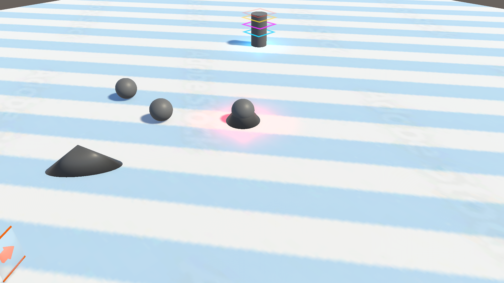
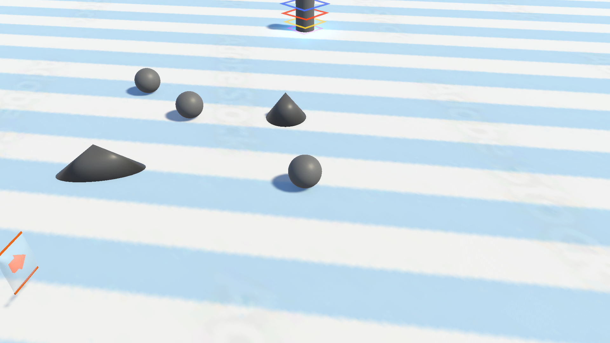
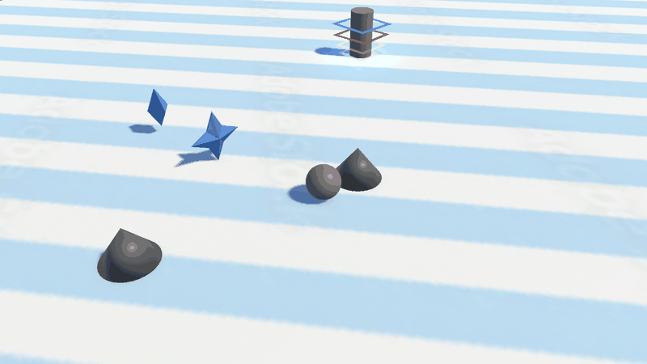
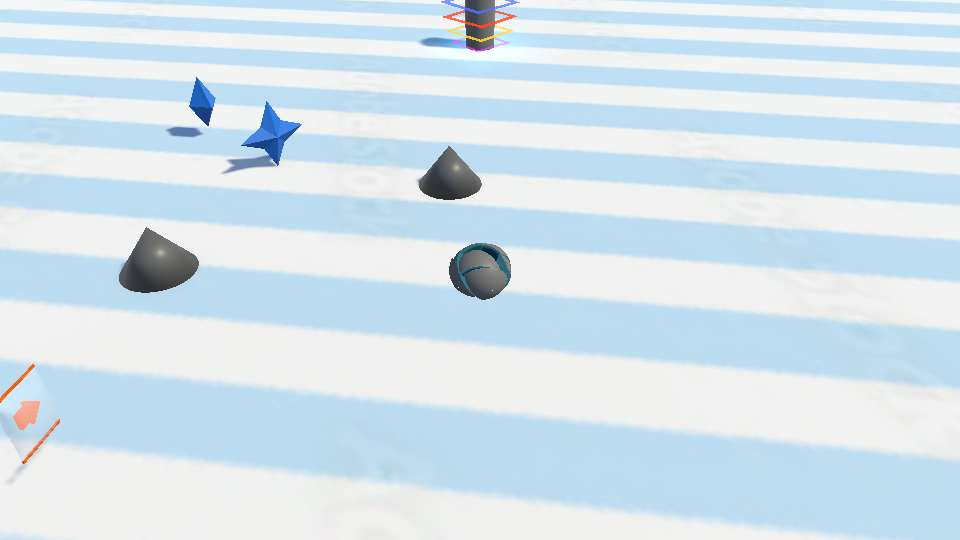

# トゲ即死・接触演出・暗転復帰の確認

対象: [Issue #39](https://github.com/R-production004682/Roll-a-Ball/issues/39)、[Issue #181](https://github.com/R-production004682/Roll-a-Ball/issues/181)。Unity 6000.3.20f1、`Assets/Scenes/TestScene/Ingametest.unity` で確認。

## 変更内容

- `SpikeHazard` が Player 本体・子 Collider の Trigger / Collision 接触から `PlayerRespawnController.TryDie` を呼ぶ。死亡状態は即座に確定し、入力・速度・物理演算を止める。死亡中の追加接触はエフェクトも再発火しない。
- 接触演出には既存の `FX-C-SPIKE-01_spike_contact.prefab` と `SpikeContactEffect.PlayAt` を使用する。既存の赤い被弾表現を維持し、新規 Shader / Material / ParticleSystem は追加していない。
- 接触演出を 0.2 秒見せてから既存 `FadeTransition` で 0.25 秒かけて暗転する。完全暗転中に最後の有効なチェックポイントへ復帰し、未通過ならスタート地点へ戻す。スタート地点の参照がない場合は初期位置へ戻す。
- 暗転中に Cinemachine の追従位置も移し、完全暗転のまま一フレーム反映してから 0.25 秒かけて暗転解除する。入力と物理演算は暗転解除完了まで止める。
- 落下も同じ死亡・暗転経路を使う。死亡中はチェックポイントの追加登録とゴール開始を抑止する。Player の無効化時も復帰、暗転解除、入力ロック解除を行う。
- `FadeTransition` の中断時に alpha を 0 に戻す。画面切り替えでも完全暗転中の更新を一フレーム反映する。

## Prefab とシーン設定

`Assets/Prefabs/InGame/SpikeHazard.prefab` は次の構成。`.meta` は Unity が生成し、既存モデル・エフェクトは入れ子 Prefab として参照する。

```text
SpikeHazard (コンテナのみ、Rigidbody なし)
├─ A10_spike (SpikeHazard, 既存モデル, convex MeshCollider / isTrigger=true)
└─ FX-C-SPIKE-01_spike_contact (既存エフェクト)
```

判定スクリプトと Collider を同一オブジェクトへ配置し、Player 側の動的 Rigidbody との接触通知を受け取る。トゲ側の Rigidbody と実行時の追加処理は廃止した。`effectAnchor` は未設定で接触位置を使用、`contactCooldown=0.35`、`effectDelay=0.2`。

| Ingametest の対象 | 設定 |
|---|---|
| SpikeHazard_Trigger | Position `(2.5, 0.5, 3.5)`、Scale `(1, 1, 1)` |
| SpikeHazard_Scaled | Position `(-4, 0.5, 5)`、Scale `(1.8, 1, 0.7)`、Rotation Y `35` |
| PlayerRespawnController.followCamera | PlayerFollowCamera の CinemachineCamera |
| PlayerRespawnController.hitCameraEffect | PlayerFollowCamera の HitCameraEffect |
| Main Camera | 削除済みカメラスクリプトの Missing 参照を除去し CinemachineBrain を追加 |
| PlayerFollowCamera | Player を追従、WorldSpace、FollowOffset `(-8, 8, -8)`、FOV `40` |
| CheckPoint / CheckPoint (1) | 復帰時に球が床へ埋まらないよう位置 Y を `0.55` に設定 |

シーンへの配置・設定・再生確認は Ingametest で実施。本番ステージへの配置は行っていない。


## 実施した確認と結果

Play Mode のフレーム進行を確認し、Editor から Player の位置を移して実際の物理接触を発生させた。コード上の死亡 API 呼び出しだけを接触成功とは扱っていない。

| 確認 | 結果 |
|---|---|
| 通常トゲへの Trigger 接触、未通過時のスタート復帰 | 成功 |
| 同じトゲへ復帰後に再接触 | 成功 |
| チェックポイント登録後の最後の地点への復帰 | 成功 |
| 拡大・回転したトゲに Player の子 Collider だけを接触 | 成功（本体 SphereCollider を一時無効化） |
| isTrigger=false に一時変更した通常の Collision 接触 | 成功 |
| 落下による死亡と復帰 | 成功、トゲ専用エフェクトは再生しない |
| 二つのトゲを一時的に重ねて同時接触 | 死亡一回、重複受付なし |
| 暗転開始前 / 暗転中の Player.enabled=false | 成功、入力ロックと暗転が残らない |
| 同じトゲへの連続10回接触 | 10回とも成功 |
| 上記の通常復帰 | alpha=1 中に移動、復帰後 alpha=0、入力解除、Rigidbody 復元を確認 |
| 死亡中のチェックポイント追加 / Goal 開始 | ともに抑止を確認 |
| チェックポイントの実際の Trigger 通過 | 登録成功 |
| 既存 FixedUpdate の移動加速 | Player が移動することを確認 |
| スタート参照未設定・登録地点なしの復帰 | 初期位置へ復帰成功 |
| 通常の Goal 接触 | 演出、StageCompleted、ResultCanvas 表示を確認。ゴール後の死亡要求も拒否 |

物理接触を含む19ケースの記録は [spike-verification.txt](spike-verification.txt)。変更した C# 4 ファイルは `dotnet format whitespace --verify-no-changes` に成功。Unity のコンパイルエラーなし。新規 Prefab のインポート・参照設定を確認済み。Play Mode を終了し、Ingametest を未保存変更なしで開いている。






## レビュー時の確認手順

1. `Assets/Scenes/TestScene/Ingametest.unity` を開いて再生する。
2. WASD で通常サイズまたは拡大したトゲに触れる。即時に操作が止まり、被弾演出の後に暗転することを確認する。
3. チェックポイント未通過なら StartPoint、通過済みなら最後のチェックポイントへ戻り、その後に暗転が解除されることを確認する。
4. 同じトゲへ繰り返し触れ、毎回復帰できることを確認する。球の端だけの接触でも判定されることを確認する。
5. 地面の外へ落下し、同じ暗転・復帰が行われることを確認する。
6. 通常のゴール接触でクリア演出とリザルト表示が動くことを確認する。

## 追加した DOTween 被弾演出

ユーザーの追加依頼に合わせ、`PlayerFollowCamera` に再利用可能な `HitCameraEffect : CinemachineExtension` を追加した。トゲ接触を受理した瞬間に PlayerRespawnController.TryDie から公開 API の Play を呼ぶ。落下では再生しない。

| 要素 | 採用値・実装 |
|---|---|
| 位置シェイク | カメラのローカル方向で `(0.22, 0.14, 0.03)`、DOTween.Shake |
| 傾きシェイク | `(0.6, 0.8, 1.6)` 度、Z は画面のロール、DOTween.Shake |
| 瞬間ズーム | FOV を 2.5 度狭め、Ease.OutCubic で元へ戻す |
| 時間 | 0.28 秒、14 振動、Harmonic、減衰あり、unscaled time |
| 暗転との接続 | 接触から 0.2 秒後に暗転開始、0.28 秒で揺れ終了、0.45 秒で完全暗転・復帰 |
| 後片付け | 完了・再生し直し・無効化・破棄・追従対象の瞬間移動で所有 Tween と補正値を消去 |

Cinemachine の追従計算後の CameraState へ加算し、Main Camera、追従対象、トゲの Transform や Collider を Tween で動かさない。カメラ演出専用の処理は Player の物理ロジックから分離し、新規パッケージ・マテリアル・全画面 UI は追加していない。強さ・時間・振動回数・ズーム量は PlayerFollowCamera の Inspector で調整できる。

Ingametest の実際の物理接触で10回連続再生し、位置の補正（最大約0.26）、傾き（最大約1.89度）、ズーム（FOV 約37.54まで）が実カメラへ反映されることを確認。復帰後は位置・傾き補正がゼロ、FOV が40に戻り、入力と物理状態も復元された。Player 無効化、カメラ演出コンポーネントの無効化、落下時に被弾演出を再生しない経路も確認した。

記録は [hit-camera-verification.txt](hit-camera-verification.txt)。trial=11 の初回判定は、中断する演出にも通常再生と同じ揺れ幅を要求したため visible=False になった。中断後の cameraReset / inputPhysicsRestored は成功している。続けて専用確認を行い、再生中のコンポーネントを無効化すると Tween が即停止し、次のカメラ更新で補正がゼロに戻ることを確認した。

Unity コンパイルと Play Mode 確認、C# 5ファイルの format whitespace 検査は成功。新規スクリプトの `.meta` は Unity が生成し、Player からの参照を確認した。追加のビルド・実機キー操作確認は未実施。



## 責務と配置の整理

- `Assets/Script/Ingame/SpikeHazard.cs`: CheckPoint / Goal / Coin と同じ機能別配置で、接触受付と死亡要求・接触エフェクトの連携を担当する。既存 `.meta` の GUID を維持して移動した。
- `Assets/Script/Ingame/PlayerRespawnController.cs`: 今回追加した死亡状態、物理停止・復元、入力ロック、待機、暗転、初期位置フォールバック、復帰位置への移動とカメラ通知、中断時の後片付けを担当する。Ingametest の Player に追加し、カメラ参照も Player から移行した。
- `Player.cs`: 従来の操作、落下検出、チェックポイント登録、ゴール停止を維持する。新しい復帰コンポーネントへ死亡を要求し、最後のチェックポイントの位置・向きを提供する。スタート地点と落下座標の既存シリアライズ設定を維持した。保存済みシーンに復帰コンポーネントがない場合は Awake で補う。
- `Assets/Script/Presentation/Camera/HitCameraEffect.cs`: 汎用のカメラ演出として配置した。トゲ専用 VFX 配下から `.meta` の GUID を維持して移動し、DOTween / Cinemachine の演出処理を担当する。

構造変更後、Ingametest で実際の物理接触を含む20ケースを確認した。通常・拡大・子 Collider・Collision・落下・繰り返し10回・初期位置フォールバック・重なるトゲの全経路で成功。通常完了は完全暗転中に移動し、明転後に入力・物理状態が戻ることを確認した。Player 無効化、復帰コンポーネント無効化、死亡中のチェックポイント・ゴール抑止、通常のゴール接触とゴール後の死亡拒否も成功した。

記録は [respawn-refactor-verification.txt](respawn-refactor-verification.txt)。trial=7 は無効化前に読み取った alpha で後片付けを判定したため初回のみ False。停止後の alpha を再取得する専用確認では PASS=True、alpha=0、入力ロック解除、物理復元、演出停止を確認した。スクリプト移動後の GUID、Prefab とシーンの Collider・カメラ参照、Unity コンパイルを確認済み。C# 6ファイルの format whitespace と git diff --check に成功した。

## その場で割れる Player 演出

`PlayerFracturePresentation` が元の Renderer の表示を管理し、再利用可能な `FX-C-PLAYER-01_in_place_fracture.prefab` を再生する。死亡・復帰の制御は `PlayerRespawnController`、閉じた破片メッシュの生成は `ConvexFractureMesh`、DOTween と粒子の再生は `PlayerFractureEffect` に分離した。

球をランダムな平面で不揃いな2～8片に切り分け（Inspector では最大12片）、切断面を閉じる。専用 URP Shader が青緑の断面とシアンの亀裂を描き、破片を少し開いて傾け、その場へ沈ませる。下向きの小さな粒子22個を遅れて落とす。爆発的な飛散や Player の Collider・Rigidbody の変更は行わない。

演出ありの場合、接触後0.52秒間は砕ける姿を表示し、0.25秒の暗転後（約0.77秒）に復帰位置へ移動する。完全暗転中に元の Renderer とカメラを復元してから明転する。上記カメラ単独テストの0.2秒待機は、砕ける演出を設定していない場合の値。

- 実際の物理接触を含む24ケースを検証。2～8片の各設定、ランダム10回、落下、最後のチェックポイント、中断、参照なし、元から非表示の Renderer の復元を確認した。trial=17 は中断後に開始状態を採取したため初回のみ False。開始と後片付けを別々に採取した専用再検証は PASS=True。
- 分割数2～12 × 10 seed の110ケースすべて成功。指定数、閉じた断面、正の不揃いな体積、元の体積との誤差、後片付けを検証した。Editor 内の生成時間の最大値は34.95msで、実機の性能測定は未実施。
- Unity コンパイル、Shader の対応・コンパイルエラーなし、C# 9ファイルの whitespace 検査を確認。後片付け後の生成破片 Mesh は0個。

記録: [物理・復帰テスト](player-fracture-verification.txt)、[分割メッシュ検証](player-fracture-geometry.txt)。下の画像は実カメラの出力で、Canvas の暗転オーバーレイを含まない。



## 最終時点の未実施確認・既存の制約

### Player_new Prefab の追加確認

`Assets/Prefabs/InGame/Player_new.prefab` の演出参照は設定済みだったが、参照先 `A15_ball_env.fbx` の Mesh が読み取り不可で破片生成を拒否していた。ModelImporter の Read/Write を有効にし、Player_new Prefab とその既存 GUID を PR に追加した。

Play Mode でこの Prefab を実際に生成し、死亡受付、2片の生成、元 Renderer の非表示、暗転・復帰後の Renderer / Rigidbody 復元、生成 Mesh の後片付けを確認した（PASS=True）。記録は [player-new-prefab-verification.txt](player-new-prefab-verification.txt)。実機ビルドの確認は未実施。今回の Console には既存 Missing Script に加えて Editor の SerializedProperty 破棄後アクセスの例外が2件あり、コンソール全体がエラーなしとはしていない。

- 実機キーボードによる連続プレイ、各画面比率、ビルド確認は未実施。
- Ingametest の既存 `RetryButton` / `StageSelectButton` に Missing Script がある。起動時に各二件の警告が出る。
- Ingametest の `GameManager.outGameClearController` は元から未設定。ゴール後に未設定エラーが一件出るが、今回確認したクリア演出とリザルト表示は成功。ステージ記録保存、リザルトからのリトライ・ステージ選択は今回の確認対象外。
- テスト中の参照未設定・子 Collider・通常 Collision・重ね配置・無効化等は Play Mode 内だけの一時変更で、保存したシーンには残していない。
