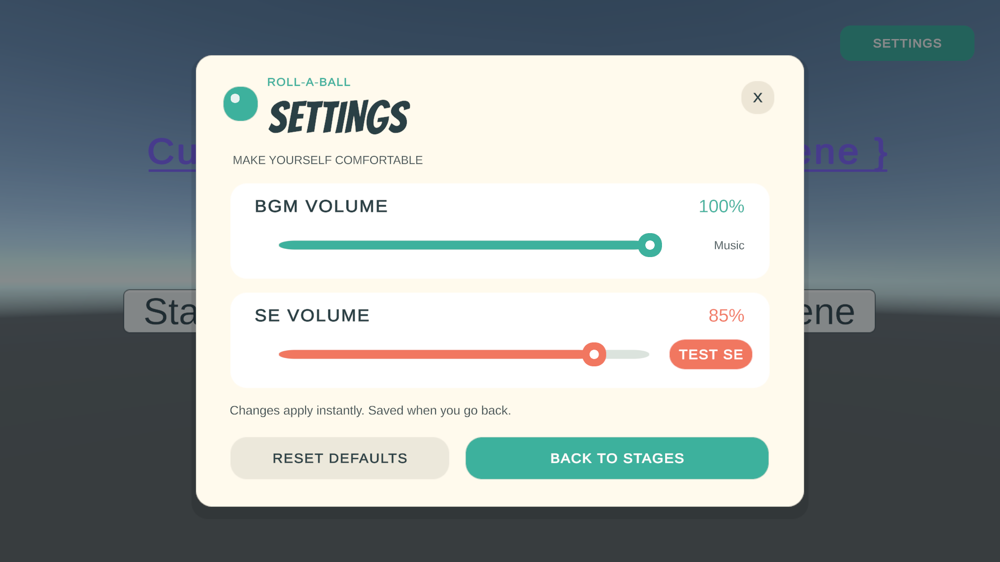
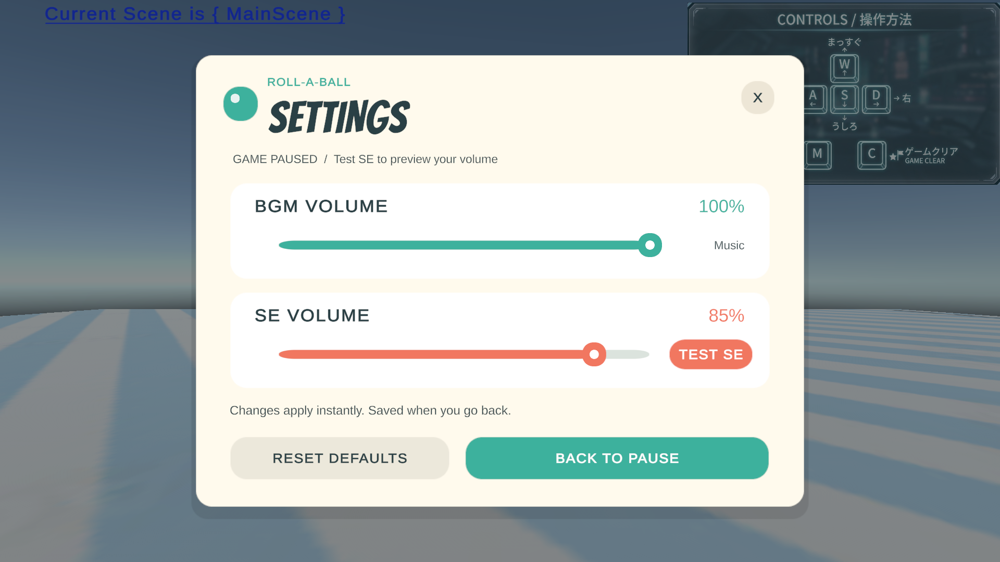

# 設定画面 — Issue #90

## 操作

- StageSelectScene の右上の `SETTINGS` で開く。
- OutGameTestScene は `M` でポーズメニューを開き、`SETTINGS` を選ぶ。
- `BGM VOLUME` / `SE VOLUME` は 0～100%。変更は即時反映される。
- `TEST SE` で既存の `Test_OK_SE.mp3` を試聴する。連打時は前の試聴を止めて再生する。
- `RESET DEFAULTS` で BGM 70%、SE 80% に戻して保存する。
- 戻るボタン、右上の `X`、Esc で閉じて保存する。ポーズから開いた場合はポーズを維持し、`RESUME` で再開する。
- ダイアログ内は上下キーで項目移動、左右キーで音量変更が可能。

今回は既存 UI に合わせた英語表記。設定ボタンの押下アニメーション・効果音・エフェクトは追加していない。操作感度・画面表示設定は具体的な仕様がないため追加していない。

## 構成

- `Assets/Prefabs/Settings/SettingsDialog.prefab`: 共通 UI。両シーンに Prefab インスタンスを配置。
- `SettingsDialogController`: UI と試聴、呼び出し元への復帰を管理。UI はシーン上で編集可能。
- `GameSettings`: 全シーン共通の設定値と保存処理。PlayerPrefs の `RollABall.Settings.BgmVolume` / `RollABall.Settings.SeVolume` を使う。初回アクセス時に読み込み、ダイアログを閉じる時・アプリ中断時・終了時に保存する。
- `AudioVolumeBinding`: AudioSource に追加し、Channel を Bgm / Se に指定する。元の音量調整は Base Volume で行う。今後追加するゲーム音にもこのコンポーネントを付ける。
- 両シーンの既存 BGM AudioSource に音量設定を接続し、ループ再生を有効化。
- `OutGameStateController`: ポーズ・クリア中は AudioListener.pause で通常音を停止。試聴用 AudioSource だけ ignoreListenerPause を有効にする。
- `StageSelectController`: 既存のステージ開始ボタンから OutGameTestScene を開く。
- 設定用の角丸 Sprite と、既存 Bangers フォントから生成した見出し専用の静的 SDF を `Assets/UI/Settings` に配置。

## 動作確認（2026-09-07、Unity 6000.3.20f1）

Unity Editor の Play Mode で実行。Button の登録イベント、Slider の PointerDown / Drag / PointerUp、実際のシーン遷移と AudioSource を使って検証した。

| 確認内容 | 結果 |
| --- | --- |
| ステージ選択から開く・閉じる | 成功。ステージ選択に留まる |
| ステージ開始ボタン | OutGameTestScene に遷移 |
| BGM 23%、SE 41% への変更 | AudioSource と表示へ即時反映 |
| スライダーをクリック・ドラッグ | 0% と 100% に到達 |
| SE 試聴 | 設定音量で AudioSource が再生状態になる |
| 通常 SE 用 AudioVolumeBinding | 音量 36% を反映 |
| ポーズ中の通常 BGM / SE | AudioListener.pause が有効、サンプル位置が進まない |
| ポーズ中の試聴 | 通常音の停止を維持したまま試聴用 Source が再生 |
| 設定からポーズへ戻る | メニュー再表示、timeScale=0 と音声停止を維持 |
| RESUME | timeScale=1、音声停止解除 |
| 初期値に戻す | BGM 70%、SE 80% に戻り保存 |
| 保存・シーン間共有 | 設定を保持 |
| Play Mode 終了→再開始（ドメイン再読み込み） | 保存した 23% / 41% を復元 |
| 共通 Prefab の必須参照・ボタン接続・Missing Script | 問題なし |
| 修正後の両画面の表示 | 1280×720 のキャプチャで確認、文字切れ・重なりなし |
| Unity Console | 最終確認時にエラー 0 件 |

保存値は検証後に作業前の BGM 100% / SE 85% へ復元した。実際のスピーカーでの聴感確認、単独実行ビルドの再起動確認は未実施。再起動時の保存確認は Editor の Play Mode 再開始で実施した。
